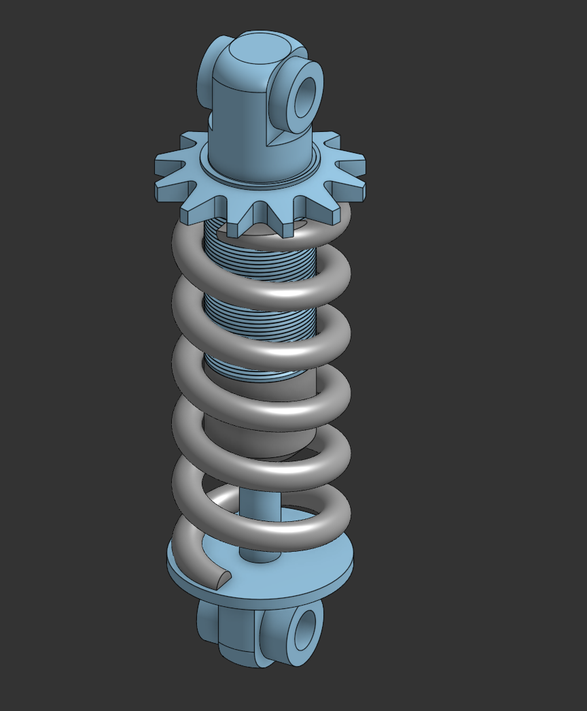

# Shock Absorber Design and Assembly

## 📌 Overview
This project presents the **design and mechanical assembly of a shock absorber system**.  
All components were designed from scratch and then assembled into a complete functional shock absorber.

The design follows a coil-over configuration, combining a spring and damper structure in a compact mechanical system.

## 🎯 Project Purpose
The objective of this project is to:
- Practice mechanical part design for motion and load absorption.
- Understand how shock absorber components interact mechanically.
- Apply proper assembly techniques for spring-based systems.

This project was created **for learning and training purposes only**.

## ⚙️ Design & Assembly Scope
- Custom design of all mechanical parts.
- Assembly of the shock absorber components into a single system.
- Focus on alignment, compression movement, and mechanical fit.
- No physical testing or simulation was performed.

## 🛠️ Key Components
- Shock body
- Coil spring
- Top and bottom mounting joints
- Internal shaft and support components

## 🔗 Onshape Link
[View Shock Absorber on Onshape](https://cad.onshape.com/documents/29898f60a6d5fa98c7035915/w/c027b0080ec57d55ffd3c461/e/b2e9fe28675e6842b37eea7b?renderMode=0&uiState=69839cc5683df1cb1ba504a0)
